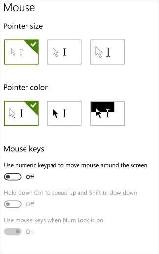

<!-- Method syntax.
public AutomationHeadingLevel AutomationProperties.GetHeadingLevel(DependencyObject element)
-->

# Microsoft.UI.Xaml.Automation.AutomationProperties.GetHeadingLevel

## -description
Gets the value of the [AutomationProperties.HeadingLevel](automationproperties_headinglevelproperty.md) property for the specified [DependencyObject](../microsoft.ui.xaml/dependencyobject.md).

## -parameters
### -param element
The specified [DependencyObject](../microsoft.ui.xaml/dependencyobject.md).

## -returns
The value of the [AutomationProperties.HeadingLevel](automationproperties_headinglevelproperty.md) property.

## -remarks
Heading elements organize the user interface and make it easier to navigate. Some assistive technology (AT) allows users to quickly jump between headings. Headings have a level from 1 to 9.

Examples of headings would be section titles within the Windows Settings app. For instance, under the **Ease of Access** -> **Mouse** page, **Pointer size**, **Pointer color**, and **Mouse keys** would be a heading of level 1.

## -see-also
[SetHeadingLevel](automationproperties_setheadinglevel_1432143745.md), [Landmarks and Headings](/windows/apps/design/accessibility/landmarks-and-headings)

## -examples
